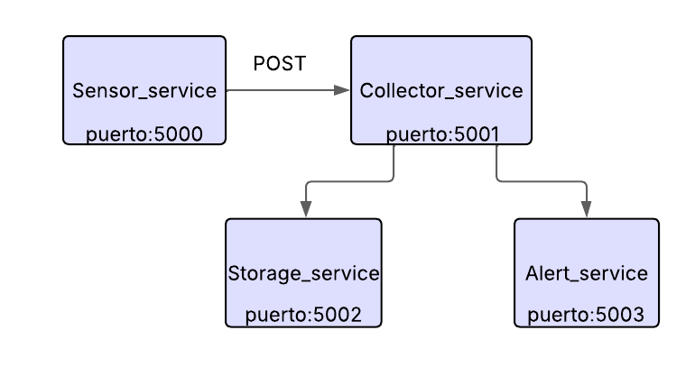

# P´ractica 2: Sistema de Monitoreo Ambiental Distribuido  (con Springboot y docker)
**Realizado por: Francisco Javier García Rosados y Diego Sebastián Reyes García**

## Problemática planteada

Esta práctica plantea una problemática en donde la solución sea un proyecto que utilice una arquitectura distribuida utilizando las tecnologías Spring Boot (Java) y Docker.

---

## Solución propuesta

Se escogió el modelo de microservicios.

El proyecto consta de 4 microservicios, los cuales realizan sus tareas independientemente para después proveer información a los otros servicios. Los microservicios son los siguientes:

- **sensor_service**: Simula sensores y envía datos en formato JSON.
- **collector_service**: Recibe los datos y los reenvía.
- **storage_service**: Guarda los datos por barrio.
- **alert_service**: Emite alertas por valores extremos.

---

## Tecnologías utilizadas

El proyecto fue desarrollado utilizando las siguientes herramientas y tecnologías:

- **Java 17**  
  Lenguaje principal para la implementación de los microservicios.

- **Spring Boot**  
  Framework para facilitar la creación de aplicaciones web y RESTful.

- **Maven**

    Herramienta de automatización que se encarga de compilar el código, gestionar las dependencias (librerías externas como Spring), y empaquetar la aplicación en un archivo ejecutable (JAR).
    Además, permite simplificar el ciclo de vida del proyecto y mantener todo organizado desde el   archivo pom.xml.

- **JAR**

    Es el formato en el que se empaqueta cada microservicio. Un archivo .jar contiene el código compilado del servicio, las dependencias necesarias y los recursos.
    Cada microservicio se ejecuta como un “fat jar” (JAR ejecutable independiente) gracias a Spring Boot.

- **Docker**  
  Para contenerizar y aislar cada microservicio en su propio entorno.

- **Docker Compose**  
  Herramienta para orquestar todos los contenedores en una sola red.

- **HTTP / REST APIs**  
  Comunicación entre microservicios usando JSON a través de peticiones HTTP.

---
## Orquestación con Docker Compose

Para que estos microservicios estén conectados entre sí y se puedan ejecutar en conjunto, se utiliza el archivo `docker-compose.yml`.

### Puntos clave del docker-compose:

- Todos los microservicios se conectan a una red Docker llamada `red_sensores`.
- `sensor_service` depende de `collector_service`.
- `collector_service` depende de `storage_service` y `alert_service`.

### Exposición de puertos:

| Microservicio      | Puerto |
|--------------------|--------|
| sensor_service     | 5000   |
| collector_service  | 5001   |
| storage_service    | 5002   |
| alert_service      | 5003   |

---

## Flujo del Proyecto

El flujo general del sistema es el siguiente:

1. `sensor_service` genera datos ambientales aleatorios cada 5 segundos.
2. Envía estos datos al endpoint `/datos` de `collector_service`.
3. `collector_service` reenvía los datos a:
   - `storage_service`, que los almacena en memoria.
   - `alert_service`, que analiza y emite alertas si es necesario.

---

## Funcionamiento de los microservicios

### sensor_service

Este microservicio simula sensores ambientales que generan datos periódicos (temperatura, humedad, calidad del aire) para diferentes barrios. Los datos se envían automáticamente cada 5 segundos al microservicio `collector_service` en formato JSON mediante una petición HTTP POST.

#### Componentes principales:

- **SensorController.java**  
  Permite verificar que el microservicio está en funcionamiento mediante una petición `GET /`.

- **SensorDataGenerator.java**  
  Responsable de generar y enviar los datos automáticamente.  
  Utiliza `@PostConstruct` para iniciar la lógica tan pronto se levanta el microservicio.  
  Crea un hilo que cada 5 segundos:
  - Genera datos aleatorios:
    - `barrio`: uno de 4 barrios (Palermo, Recoleta, Belgrano, Caballito)
    - `temperatura`: valor entre 20 y 40 °C
    - `humedad`: valor entre 30% y 80%
    - `calidad_aire`: "Buena", "Moderada" o "Mala"
    - `timestamp`: fecha y hora actual en formato ISO
  - Envía los datos a: `http://collector_service:5001/datos`
  - Imprime los datos enviados en consola

- **SensorServiceApplication.java**  
  Clase principal que arranca el microservicio con Spring Boot.

---

### collector_service

Este microservicio actúa como puente de comunicación: recibe los datos generados por sensores (desde `sensor_service`) y los distribuye a otros dos servicios:

- `storage_service`: para guardar los datos.
- `alert_service`: para analizarlos y emitir alertas si es necesario.

#### Componentes principales:

- **CollectorController.java**
  - Endpoint: `POST /datos`
  - Recibe: un `Map<String, Object>` (datos JSON de sensores)
  - Acciones:
    - Reenvía los datos al endpoint `POST /guardar` de `storage_service`
    - Reenvía los datos al endpoint `POST /analizar` de `alert_service`
  - Respuesta: `"OK"` con código HTTP 200

- **CollectorServiceApplication.java**  
  Clase principal que arranca el microservicio con Spring Boot.

---

### storage_service

Este microservicio se encarga de almacenar datos ambientales clasificados por barrio. Actúa como repositorio temporal en memoria, permitiendo guardar y consultar registros ambientales.

#### Endpoints:

- **POST /guardar**  
  - Guarda un registro ambiental según el barrio especificado.  
  - Entrada: JSON con campos como `barrio`, `temperatura`, `humedad`, `calidadAire`, entre otros.  
  - Salida: `"Guardado"` si el almacenamiento fue exitoso.

- **GET /datos?barrio={nombre}**  
  - Retorna todos los registros almacenados para el barrio especificado.  
  - Salida: Lista de objetos JSON con los datos asociados al barrio.

---

### alert_service

Este microservicio analiza los datos ambientales recibidos y emite alertas cuando detecta condiciones críticas, como temperaturas muy altas o mala calidad del aire. No almacena datos, solo los procesa y genera advertencias si es necesario.

#### Componentes principales:

- **AlertCollector.java**
  - Define el endpoint `POST /analizar`
  - Recibe datos JSON con información ambiental
  - Extrae los valores relevantes (`temperatura`, `calidad_aire`)
  - Aplica las siguientes reglas:
    - Si la temperatura > 35 °C → se imprime una alerta en consola
    - Si la calidad del aire es "Mala" → también imprime alerta
  - Responde con `"Analizado"` y código HTTP 200

- **AlertServiceApplication.java**  
  Clase principal que arranca el microservicio con Spring Boot.

---

## Conclusión

Este proyecto demuestra cómo construir una arquitectura distribuida basada en microservicios para un caso de monitoreo ambiental urbano. Con Spring Boot y Docker, se logra una solución escalable, modular y fácilmente desplegable. Cada componente cumple una función clara dentro del sistema, y la orquestación con Docker Compose permite integrarlos sin complicaciones.
